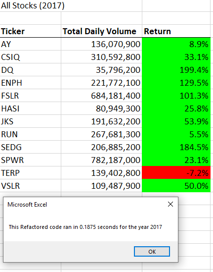
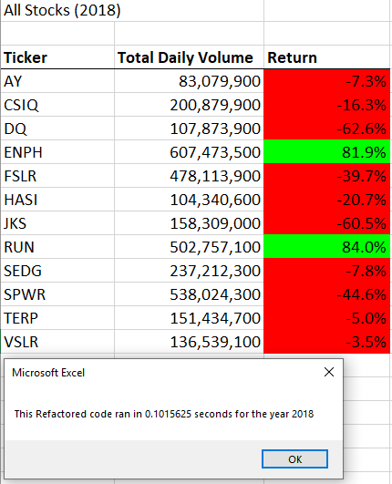

# VBA Challenge
## Overview of Project
Create a VBA script that allows the comparison of several green energy stocks performance over the years 2017 and 2018. Once the VBA script is running, we will refactor the script to see if we can improve script run times.    
### Purpose
The main purpose of the "VBA Challenge" is to understand the impact of refactoring VBA scripts.  As data sets grow over time, refactoring can become especially important.   
### Background
New finance graduate Steve has decided to help his parents understand the performance of 12 green energy stocks over the years 2017 and 2018.  Steve has requested help creating a VBA script that allows him to analyze these tickers at once. 
## Results
### Runtime Analysis of 2017 and 2018 Code
The original VBA script created "yearValueAnalysis" allows a user to run all 12 tickers for a given year. The script starts by asking which year they would like to analyze.  Once a user selects the year to analyze, the script goes through each ticker for that year and summaries the following: Ticker, Total Daily Volume and Return.  This is accomplished going row by row for each ticker using loops.  A few added features incorporated were the use of buttons.  Steve will find a clear button called, “Clear Data” which resets the cells for a new analysis.  The button “Run Analysis for All” contains the original VBA script to run 2017 and 2018 tickers.  
“Ticker” is simple the assigned stock symbol for a given company.  The “Total Daily Volume” sums up the daily trading volume over the year selected.  “Return” is defined as the percent of the ending price divided by the starting price.  To aid in readability, we added interior cell color conditional formatting for the return values.  Green colored Returns are Tickers that had a positive return for the year.  Any red colored Returns are Tickers that lost value over the year. 
Displayed below is the run time and summary results for 2017 and 2018.

### Runtime Analysis of Refactored Code
The original script runs very quick since there are only 12 tickers to analyze.  Our script is running fine but what if we could make it better.  We refactored the script to reduce the run time.  The new refactored script is called “AllStocksAnalysisRefactored”.  We added a third button, “Run Analysis for All Refactored” so Steve will know which script he is running.
The run time results and summaries for 2017 and 2018 can be found below:

The refactored script was successful in reducing run times from the original script.  The orginal script had a run time of a little more than ~1 second and the refactored script has a run time of ~0.1 seconds.  While our dataset is only 12 tickers, we can see how adding thousands of tickers could impact run times significantly.  The refactored analysis summaries for Ticker, Total Daily Volume, and Return are the same as the original script.  While the output is the same for both scripts the way the computer processed the output was completely different.  In the refactored script, we utilized arrays and indexing instead of going row by row.  

## Summary
Refactoring is a way of restructuring and optimizing code WITHOUT changing its desired outputs.  Optimizing code is a great way to improve runtime performance.  Care must be taken that refactored code is still providing the same output even if it is running faster.    
The original VBA script is easier to understand how the script is being executed.  The disadvantage is the script could become slow if large datasets are encountered.  The refactored code has the advantage of significantly faster runtimes with the same output.  

